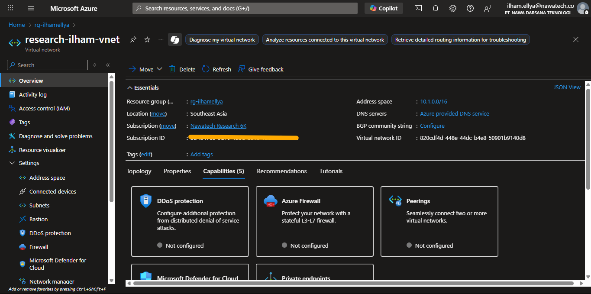
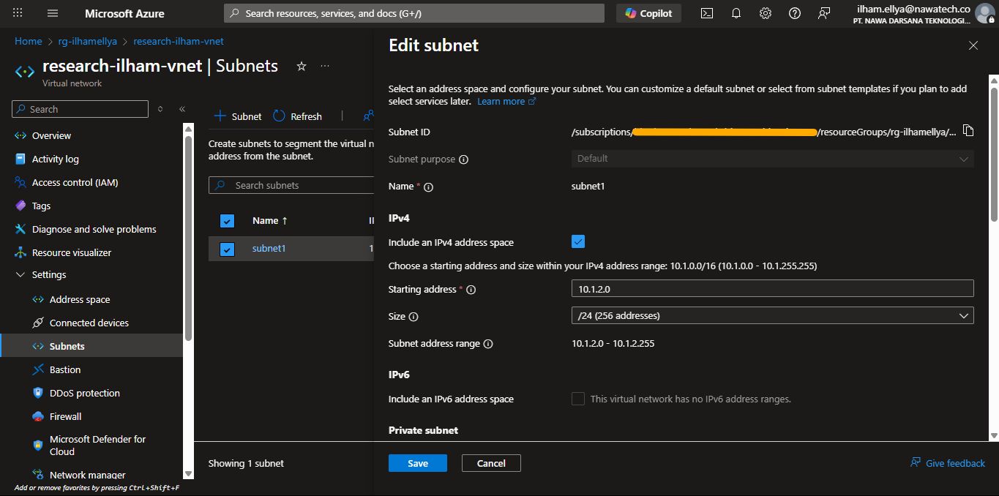
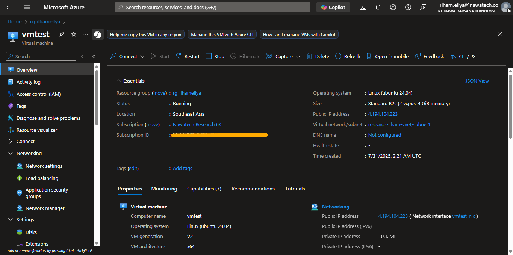
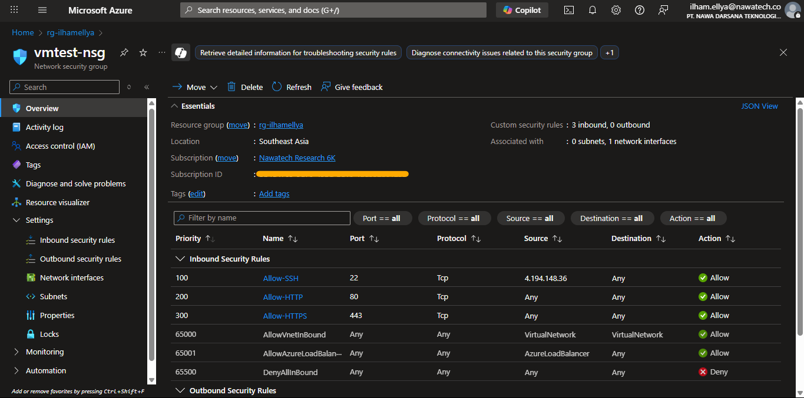
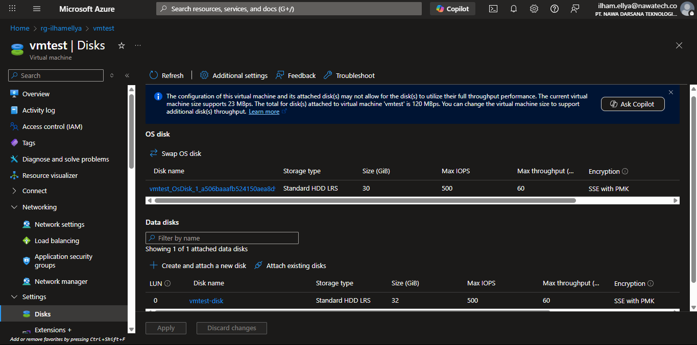

Modules capability

**Compute:**
- Multiple VMs
- Data Disk (Optional)
- NSG configuration
- Credentials (Password or SSH key)

**Network:**
- Multiple Subnets
- Nat Gateway

---

## Test Scenario

1. Provision resource group and blob storage from portal
2. Provision networking environment with network module
3. Provision VM with value from networking environment tfstate

---

## Documentation

### 1. Networking Environment

```sh
$ terraform apply -var-file=net.tfvars
```

Output:

```
Acquiring state lock. This may take a few moments...

Terraform used the selected providers to generate the following execution plan. Resource actions are indicated with the
following symbols:
  + create

Terraform will perform the following actions:

  # module.network.azurerm_subnet.subnet["subnet1"] will be created
  + resource "azurerm_subnet" "subnet" {
      + address_prefixes                              = [
          + "10.1.2.0/24",
        ]
      + default_outbound_access_enabled               = true
      + id                                            = (known after apply)
      + name                                          = "subnet1"
      + private_endpoint_network_policies             = "Disabled"
      + private_link_service_network_policies_enabled = true
      + resource_group_name                           = "rg-ilhamellya"
      + virtual_network_name                          = "research-ilham-vnet"
    }

  # module.network.azurerm_virtual_network.vnet will be created
  + resource "azurerm_virtual_network" "vnet" {
      + address_space                  = [
          + "10.1.0.0/16",
        ]
      + dns_servers                    = (known after apply)
      + guid                           = (known after apply)
      + id                             = (known after apply)
      + location                       = "southeastasia"
      + name                           = "research-ilham-vnet"
      + private_endpoint_vnet_policies = "Disabled"
      + resource_group_name            = "rg-ilhamellya"
      + subnet                         = (known after apply)
    }

Plan: 2 to add, 0 to change, 0 to destroy.

Changes to Outputs:
  + subnet_ids       = {
      + subnet1 = (known after apply)
    }
  + subnet_names     = [
      + "subnet1",
    ]
  + vnet_id          = (known after apply)
  + vnet_name        = "research-ilham-vnet"

Do you want to perform these actions?
  Terraform will perform the actions described above.
  Only 'yes' will be accepted to approve.

  Enter a value: yes

module.network.azurerm_virtual_network.vnet: Creating...
module.network.azurerm_virtual_network.vnet: Still creating... [00m10s elapsed]
module.network.azurerm_virtual_network.vnet: Creation complete after 14s [id=/subscriptions/{subsid}/resourceGroups/rg-ilhamellya/providers/Microsoft.Network/virtualNetworks/research-ilham-vnet]
module.network.azurerm_subnet.subnet["subnet1"]: Creating...
module.network.azurerm_subnet.subnet["subnet1"]: Still creating... [00m10s elapsed]
module.network.azurerm_subnet.subnet["subnet1"]: Creation complete after 14s [id=/subscriptions/{subsid}/resourceGroups/rg-ilhamellya/providers/Microsoft.Network/virtualNetworks/research-ilham-vnet/subnets/subnet1]
Releasing state lock. This may take a few moments...

Apply complete! Resources: 2 added, 0 changed, 0 destroyed.

Outputs:

subnet_ids = {
  "subnet1" = "/subscriptions/{subsid}/resourceGroups/rg-ilhamellya/providers/Microsoft.Network/virtualNetworks/research-ilham-vnet/subnets/subnet1"
}
subnet_names = [
  "subnet1",
]
vnet_id = "/subscriptions/{subsid}/resourceGroups/rg-ilhamellya/providers/Microsoft.Network/virtualNetworks/research-ilham-vnet"
vnet_name = "research-ilham-vnet"
```

---

Verification (from portal):

**Virtual Network Overview**  



**Subnet Overview**  



### 2. Computing Environment

```sh
$ terraform apply -var-file=com.tfvars
```

Output:

```
Acquiring state lock. This may take a few moments...
data.terraform_remote_state.networking: Reading...
data.terraform_remote_state.networking: Read complete after 4s

Terraform used the selected providers to generate the following execution plan. Resource actions are indicated with the
following symbols:
  + create

Terraform will perform the following actions:

  # module.compute.azurerm_linux_virtual_machine.vm["vmtest"] will be created
  + resource "azurerm_linux_virtual_machine" "vm" {
      + admin_password                                         = (sensitive value)
      + admin_username                                         = "ilhamya"
      + allow_extension_operations                             = true
      + bypass_platform_safety_checks_on_user_schedule_enabled = false
      + computer_name                                          = (known after apply)
      + disable_password_authentication                        = false
      + disk_controller_type                                   = (known after apply)
      + extensions_time_budget                                 = "PT1H30M"
      + id                                                     = (known after apply)
      + location                                               = "southeastasia"
      + max_bid_price                                          = -1
      + name                                                   = "vmtest"
      + network_interface_ids                                  = (known after apply)
      + patch_assessment_mode                                  = "ImageDefault"
      + patch_mode                                             = "ImageDefault"
      + platform_fault_domain                                  = -1
      + priority                                               = "Regular"
      + private_ip_address                                     = (known after apply)
      + private_ip_addresses                                   = (known after apply)
      + provision_vm_agent                                     = true
      + public_ip_address                                      = (known after apply)
      + public_ip_addresses                                    = (known after apply)
      + resource_group_name                                    = "rg-ilhamellya"
      + size                                                   = "Standard_B2s"
      + virtual_machine_id                                     = (known after apply)
      + vm_agent_platform_updates_enabled                      = (known after apply)

      + os_disk {
          + caching                   = "ReadWrite"
          + disk_size_gb              = (known after apply)
          + id                        = (known after apply)
          + name                      = (known after apply)
          + storage_account_type      = "Standard_LRS"
          + write_accelerator_enabled = false
        }

      + source_image_reference {
          + offer     = "ubuntu-24_04-lts"
          + publisher = "Canonical"
          + sku       = "server"
          + version   = "latest"
        }

      + termination_notification (known after apply)
    }

  # module.compute.azurerm_managed_disk.data_disk["vmtest"] will be created
  + resource "azurerm_managed_disk" "data_disk" {
      + create_option                     = "Empty"
      + disk_iops_read_only               = (known after apply)
      + disk_iops_read_write              = (known after apply)
      + disk_mbps_read_only               = (known after apply)
      + disk_mbps_read_write              = (known after apply)
      + disk_size_gb                      = 32
      + id                                = (known after apply)
      + location                          = "southeastasia"
      + logical_sector_size               = (known after apply)
      + max_shares                        = (known after apply)
      + name                              = "vmtest-disk"
      + network_access_policy             = "AllowAll"
      + optimized_frequent_attach_enabled = false
      + performance_plus_enabled          = false
      + public_network_access_enabled     = true
      + resource_group_name               = "rg-ilhamellya"
      + source_uri                        = (known after apply)
      + storage_account_type              = "Standard_LRS"
      + tier                              = (known after apply)
    }

  # module.compute.azurerm_network_interface.nic["vmtest"] will be created
  + resource "azurerm_network_interface" "nic" {
      + accelerated_networking_enabled = false
      + applied_dns_servers            = (known after apply)
      + id                             = (known after apply)
      + internal_domain_name_suffix    = (known after apply)
      + ip_forwarding_enabled          = false
      + location                       = "southeastasia"
      + mac_address                    = (known after apply)
      + name                           = "vmtest-nic"
      + private_ip_address             = (known after apply)
      + private_ip_addresses           = (known after apply)
      + resource_group_name            = "rg-ilhamellya"
      + virtual_machine_id             = (known after apply)

      + ip_configuration {
          + gateway_load_balancer_frontend_ip_configuration_id = (known after apply)
          + name                                               = "internal"
          + primary                                            = (known after apply)
          + private_ip_address                                 = (known after apply)
          + private_ip_address_allocation                      = "Dynamic"
          + private_ip_address_version                         = "IPv4"
          + public_ip_address_id                               = (known after apply)
          + subnet_id                                          = "/subscriptions/{subsid}/resourceGroups/rg-ilhamellya/providers/Microsoft.Network/virtualNetworks/research-ilham-vnet/subnets/subnet1"
        }
    }

  # module.compute.azurerm_network_interface_security_group_association.nic_assoc["vmtest"] will be created
  + resource "azurerm_network_interface_security_group_association" "nic_assoc" {
      + id                        = (known after apply)
      + network_interface_id      = (known after apply)
      + network_security_group_id = (known after apply)
    }

  # module.compute.azurerm_network_security_group.nsg["vmtest"] will be created
  + resource "azurerm_network_security_group" "nsg" {
      + id                  = (known after apply)
      + location            = "southeastasia"
      + name                = "vmtest-nsg"
      + resource_group_name = "rg-ilhamellya"
      + security_rule       = [
          + {
              + access                                     = "Allow"
              + destination_address_prefix                 = "*"
              + destination_address_prefixes               = []
              + destination_application_security_group_ids = []
              + destination_port_range                     = "22"
              + destination_port_ranges                    = []
              + direction                                  = "Inbound"
              + name                                       = "Allow-SSH"
              + priority                                   = 100
              + protocol                                   = "Tcp"
              + source_address_prefix                      = "4.194.148.36"
              + source_address_prefixes                    = []
              + source_application_security_group_ids      = []
              + source_port_range                          = "*"
              + source_port_ranges                         = []
                # (1 unchanged attribute hidden)
            },
          + {
              + access                                     = "Allow"
              + destination_address_prefix                 = "*"
              + destination_address_prefixes               = []
              + destination_application_security_group_ids = []
              + destination_port_range                     = "443"
              + destination_port_ranges                    = []
              + direction                                  = "Inbound"
              + name                                       = "Allow-HTTPS"
              + priority                                   = 300
              + protocol                                   = "Tcp"
              + source_address_prefix                      = "*"
              + source_address_prefixes                    = []
              + source_application_security_group_ids      = []
              + source_port_range                          = "*"
              + source_port_ranges                         = []
                # (1 unchanged attribute hidden)
            },
          + {
              + access                                     = "Allow"
              + destination_address_prefix                 = "*"
              + destination_address_prefixes               = []
              + destination_application_security_group_ids = []
              + destination_port_range                     = "80"
              + destination_port_ranges                    = []
              + direction                                  = "Inbound"
              + name                                       = "Allow-HTTP"
              + priority                                   = 200
              + protocol                                   = "Tcp"
              + source_address_prefix                      = "*"
              + source_address_prefixes                    = []
              + source_application_security_group_ids      = []
              + source_port_range                          = "*"
              + source_port_ranges                         = []
                # (1 unchanged attribute hidden)
            },
        ]
    }

  # module.compute.azurerm_public_ip.public_ip["vmtest"] will be created
  + resource "azurerm_public_ip" "public_ip" {
      + allocation_method       = "Static"
      + ddos_protection_mode    = "VirtualNetworkInherited"
      + fqdn                    = (known after apply)
      + id                      = (known after apply)
      + idle_timeout_in_minutes = 4
      + ip_address              = (known after apply)
      + ip_version              = "IPv4"
      + location                = "southeastasia"
      + name                    = "vmtest-public-ip"
      + resource_group_name     = "rg-ilhamellya"
      + sku                     = "Standard"
      + sku_tier                = "Regional"
    }

  # module.compute.azurerm_virtual_machine_data_disk_attachment.attach_data_disk["vmtest"] will be created
  + resource "azurerm_virtual_machine_data_disk_attachment" "attach_data_disk" {
      + caching                   = "ReadWrite"
      + create_option             = "Attach"
      + id                        = (known after apply)
      + lun                       = 0
      + managed_disk_id           = (known after apply)
      + virtual_machine_id        = (known after apply)
      + write_accelerator_enabled = false
    }

Plan: 7 to add, 0 to change, 0 to destroy.

Changes to Outputs:
  + disk_ids      = {
      + vmtest = (known after apply)
    }
  + vm_ids        = {
      + vmtest = (known after apply)
    }
  + vm_public_ips = {
      + vmtest = (known after apply)
    }

Do you want to perform these actions?
  Terraform will perform the actions described above.
  Only 'yes' will be accepted to approve.

  Enter a value: yes

module.compute.azurerm_network_security_group.nsg["vmtest"]: Creating...
module.compute.azurerm_public_ip.public_ip["vmtest"]: Creating...
module.compute.azurerm_managed_disk.data_disk["vmtest"]: Creating...
module.compute.azurerm_network_security_group.nsg["vmtest"]: Creation complete after 8s [id=/subscriptions/{subsid}/resourceGroups/rg-ilhamellya/providers/Microsoft.Network/networkSecurityGroups/vmtest-nsg]        
module.compute.azurerm_public_ip.public_ip["vmtest"]: Creation complete after 9s [id=/subscriptions/{subsid}/resourceGroups/rg-ilhamellya/providers/Microsoft.Network/publicIPAddresses/vmtest-public-ip]
module.compute.azurerm_network_interface.nic["vmtest"]: Creating...
module.compute.azurerm_managed_disk.data_disk["vmtest"]: Still creating... [00m10s elapsed]
module.compute.azurerm_managed_disk.data_disk["vmtest"]: Creation complete after 13s [id=/subscriptions/{subsid}/resourceGroups/rg-ilhamellya/providers/Microsoft.Compute/disks/vmtest-disk]
module.compute.azurerm_network_interface.nic["vmtest"]: Still creating... [00m10s elapsed]
module.compute.azurerm_network_interface.nic["vmtest"]: Creation complete after 17s [id=/subscriptions/{subsid}/resourceGroups/rg-ilhamellya/providers/Microsoft.Network/networkInterfaces/vmtest-nic]
module.compute.azurerm_network_interface_security_group_association.nic_assoc["vmtest"]: Creating...
module.compute.azurerm_linux_virtual_machine.vm["vmtest"]: Creating...
module.compute.azurerm_network_interface_security_group_association.nic_assoc["vmtest"]: Still creating... [00m10s elapsed]
module.compute.azurerm_linux_virtual_machine.vm["vmtest"]: Still creating... [00m10s elapsed]
module.compute.azurerm_network_interface_security_group_association.nic_assoc["vmtest"]: Creation complete after 16s [id=/subscriptions/{subsid}/resourceGroups/rg-ilhamellya/providers/Microsoft.Network/networkInterfaces/vmtest-nic|/subscriptions/{subsid}/resourceGroups/rg-ilhamellya/providers/Microsoft.Network/networkSecurityGroups/vmtest-nsg]
module.compute.azurerm_linux_virtual_machine.vm["vmtest"]: Still creating... [00m20s elapsed]
module.compute.azurerm_linux_virtual_machine.vm["vmtest"]: Still creating... [00m30s elapsed]
module.compute.azurerm_linux_virtual_machine.vm["vmtest"]: Still creating... [00m40s elapsed]
module.compute.azurerm_linux_virtual_machine.vm["vmtest"]: Still creating... [00m50s elapsed]
module.compute.azurerm_linux_virtual_machine.vm["vmtest"]: Creation complete after 59s [id=/subscriptions/{subsid}/resourceGroups/rg-ilhamellya/providers/Microsoft.Compute/virtualMachines/vmtest]
module.compute.azurerm_virtual_machine_data_disk_attachment.attach_data_disk["vmtest"]: Creating...
module.compute.azurerm_virtual_machine_data_disk_attachment.attach_data_disk["vmtest"]: Still creating... [00m10s elapsed]
module.compute.azurerm_virtual_machine_data_disk_attachment.attach_data_disk["vmtest"]: Creation complete after 15s [id=/subscriptions/{subsid}/resourceGroups/rg-ilhamellya/providers/Microsoft.Compute/virtualMachines/vmtest/dataDisks/vmtest-disk]
Releasing state lock. This may take a few moments...

Apply complete! Resources: 7 added, 0 changed, 0 destroyed.

Outputs:

disk_ids = {
  "vmtest" = "/subscriptions/{subsid}/resourceGroups/rg-ilhamellya/providers/Microsoft.Compute/disks/vmtest-disk"
}
vm_ids = {
  "vmtest" = "/subscriptions/{subsid}/resourceGroups/rg-ilhamellya/providers/Microsoft.Compute/virtualMachines/vmtest"
}
vm_public_ips = {
  "vmtest" = "4.194.104.223"
}
```

---

Verification (from portal):

**Virtual Machine Overview**  



**Security Group Overview**  



**Disk**  

